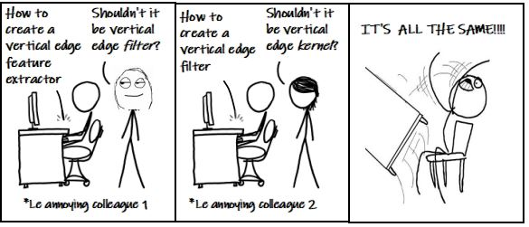
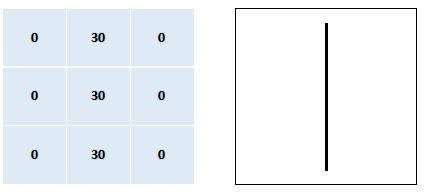
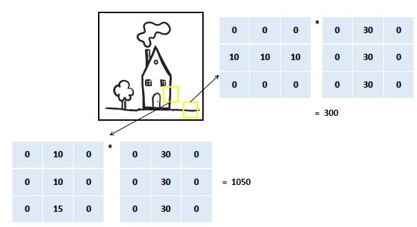
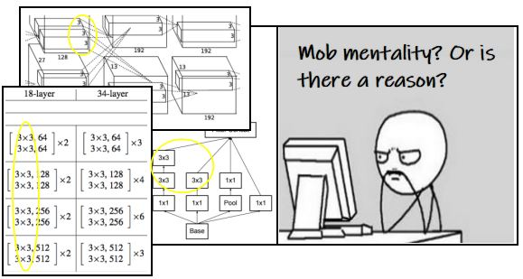
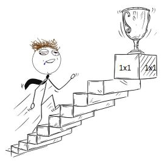

#### What are Channels and Kernels (according to EVA)?

Firstly, let's get all the synonyms out here to minimize confusion.

  

So, Kernels=Feature Extractors=3x3 matrices=Filters. And well...Channels are Channels only.  
Let's get on with their definitions. Imagine you are in a cliche high school movie and you are surrounded by all the stereotypical cliques—
popular kids, jocks, intellectuals, gamers etc. Each clique is a **channel** because it consists of feature characteristics which are very similar within the group, and
dissmilar among the other groups.Now, you need help setting up your brand new Xbox, so you try to navigate your way towards the gamers.
Well, you are in luck! The writers of the movie have given you a "RADAR 2000" which \*PINGS\* when it comes across a gamer. This "RADAR 2000"
is a **feature extractor** where the feature is a gamer. Let's move on to the real world and translate these definitions to images.

  
  
  

&nbsp; &nbsp; &nbsp; &nbsp; &nbsp; &nbsp; &nbsp; &nbsp; &nbsp; &nbsp; Popular Kids &nbsp; &nbsp; &nbsp; &nbsp; &nbsp; &nbsp; &nbsp; &nbsp; &nbsp; &nbsp; &nbsp; &nbsp; &nbsp; &nbsp; &nbsp; &nbsp; &nbsp; &nbsp; &nbsp; &nbsp; &nbsp; &nbsp; &nbsp; &nbsp; &nbsp; Jocks &nbsp; &nbsp; &nbsp; &nbsp; &nbsp; 
&nbsp; &nbsp; &nbsp; &nbsp; &nbsp; &nbsp; &nbsp; &nbsp; &nbsp; &nbsp; &nbsp; &nbsp; &nbsp; &nbsp; &nbsp; &nbsp; &nbsp; &nbsp; &nbsp; &nbsp; Intellectuals  

Generally, images have 3 channels[RGB]. For simplicity sake, we will use a grayscale image i.e. 1 channel only. When a computer sees the image below, it
sees a matrix of pixel values. This matrix is an input to a convolutional neural network which will then classify it into a category. We will 
focus on the convolutional part of the network

  
  *Source : http://ai.stanford.edu/~syyeung/cvweb/tutorial1.html*

We will consider a **32x32x1** image which means its size is 32x32 and it has only 1 channel. We also have a **3x3x1** matrix
which is a vertical edge filter. Its representation of pixel values has come through during the training of the network.  We will move the 
filter across the image in a sliding window fashion with stride 1, and at each location compute summation of the element-wise multiplications of the two 3x3 
matrices. We will end up with a **28x28x1** output channel and this is a representation of the filter at different locations in the image. But what 
do these numbers mean?
 
***Note** : The size of the channels in the input and filters should always match during convolution.

  

In the below figure, when the filter is over a region of the image where a vertical edge is present, the resulting number is very high whereas 
in the other region, it is pretty low. So, the filter *PINGS* whenever it detects its feature in the image and this information is present in the output channel.

  

---

#### Why should we only (well mostly) use 3x3 Kernels?

  

Let's work this using the process of elimination.  
1. Why can't we use large sized kernels? 
Because of the computation increase. We don't want to run out of memory! Another reason is that we want our filters to extract low level features 
(using small sized kernels) which are more common across all the images, and later build high level features using them.  
2. Why can't we use 2x2? 
Because the size of this filter is too small to detect variations in the images.  
3. Okay, let's go to mid-size filters? What about 5x5 or 7x7? 
The local receptive field we gain from using a 5x5 filter is equivalent to using two 3x3 filters. But the number or parameters in two 3x3s i.e. 
18 is lesser that 25. Hence, two 3x3s are preferable.  
4. Finally, why specifically 3x3? 
Research. It has been proven from many research papers that 3x3 kernel size works effectively. Therefore GPUs have also been accelerated for 3x3 kernel size. 

---

#### How many times do we need to perform 3x3 convolution operation to reach 1x1 from 199x199 (show calculations)

  

100 times  
199x199-->197x197-->195x195-->193X193-->191x191-->189x189-->187x187-->185x185-->183x183-->181x181 -->179x179-->177x177-->175x175-->173x173
-->171x171-->169x169-->167x167-->165x165-->163x163-->161x161 -->159x159-->157x157-->155x155-->153x153-->151x151-->149x149-->147x147-->145x145-->143x143
-->141x141 -->139x139-->137x137-->135x135-->133x133-->131x131-->129x129-->127x127-->125x125-->123x123-->121x121 -->119x119-->117x117-->115x115-->113x113-->111x111
-->109x109-->107x107-->105x105-->103x103-->101x101 -->99x99-->97x97-->95x95-->93x93-->91x91-->89x89-->87x87-->85x85-->83x83-->81x81-->79x79
-->77x77-->75x75 -->73x73-->71x71-->69x69-->67x67-->65x65-->63x63-->61x61-->59x59-->57x57-->55x55-->53x53-->51x51-->49x49 -->47x47
-->45x45-->43x43-->41x41-->39x39-->37x37-->35x35-->33x33-->31x31-->29x29-->27x27-->25x25-->23x23 -->21x21-->19x19-->17x17-->15x15-->
13x13-->11x11-->9x9-->7x7-->5x5-->3x3-->1x1
